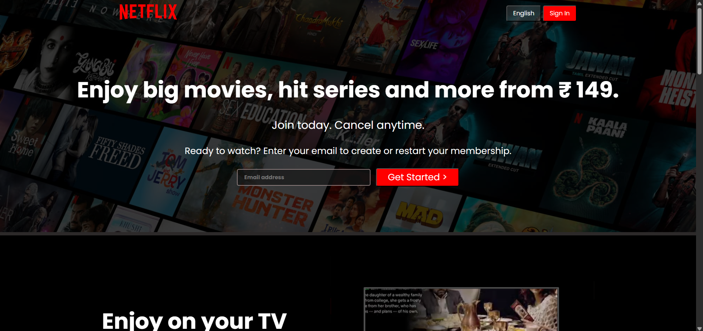
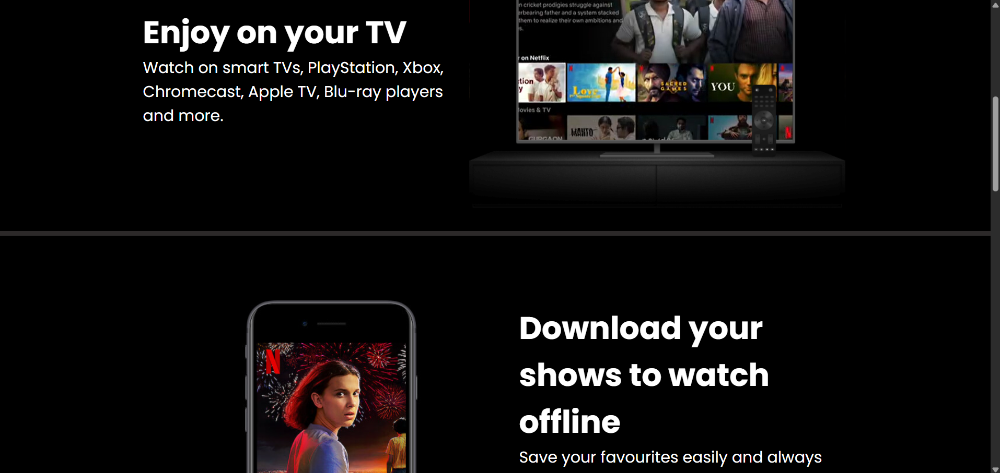
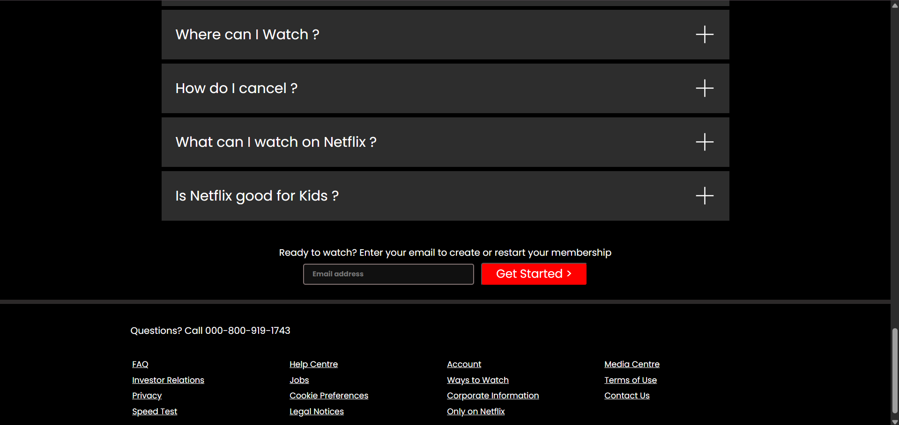

# 🎬 Netflix Clone

This is a **fully responsive Netflix India landing page clone** built using only **HTML and CSS**. It replicates the official Netflix look and feel with clean layout, visual sections, and responsive design.

---

## 📸 Screenshots

### Hero Section  

### Feature Sections  

### Footer & FAQ  

---

## 🚀 Features

- ✅ Netflix-style layout and sections
- ✅ Fully responsive (mobile, tablet, desktop)
- ✅ Embedded videos inside device frames
- ✅ FAQ accordion (static)
- ✅ Pixel-perfect design using only HTML & CSS

---

## 🗂️ Project Structure

Netflix Clone/
├── assets/
│ └── images/ # Backgrounds, logos, etc.
├── screenshots/
│ ├── screenshot1.png
│ ├── screenshot2.png
│ └── screenshot3.png
├── favicon.ico # Browser tab icon
├── index.html
├── style.css
└── README.md

---

## 🧑‍💻 Tech Stack

- HTML5
- CSS3
- Google Fonts (Poppins, Martel Sans)

---

## 🌐 Live Demo

> [🔗 View Live (GitHub Pages)](https://pranavturkar13.github.io/Netflix-Clone/) 

---

## 👤 Author

**Pranav Turkar**

- 🔗 [GitHub](https://github.com/PranavTurkar13)
- 🔗 [LinkedIn](https://www.linkedin.com/in/pranav-turkar)

---

